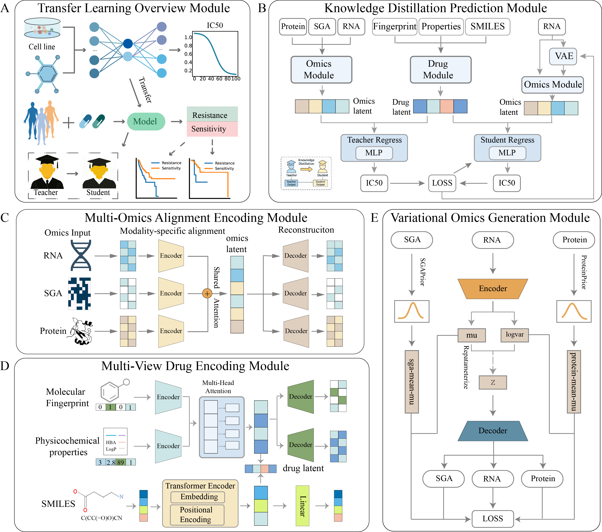

# KMDRP

`KMDRP` (Knowledge-driven Multimodal Drug Response Predictor) is a knowledge distillation-based multimodal fusion framework designed to predict tumor drug response (IC50 values) under real-world clinical data incompleteness. By integrating a teacher model trained on complete multi-omics data (RNA expression, SGA mutations, protein expression) with a student model using only RNA data, KMDRP achieves state-of-the-art prediction accuracy while addressing the challenge of modality missingness through task-aware variational generative modeling and attention-based cross-modal fusion.



## Features

- **High Accuracy**: The student model (KMDRP-S) achieves RMSE = 1.1930 and R² = 0.5960 on independent test sets, outperforming 8 baseline methods.
- **Clinical Applicability**: Specifically designed for incomplete omics data, enabling robust predictions using only RNA expression data.
- **Interpretability**: Utilizes integrated gradients and attention mechanisms to provide biological insights.
- **Dual-branch Architecture**: Teacher-student framework with knowledge distillation and task-aware generation.
- **Clinical Validation**: Demonstrates prognostic value in clinical cohorts with survival stratification and treatment response correlation.

## Getting Started

### Prerequisites
- Python >= 3.9.x
- PyTorch >= 1.10.0
- Other dependencies as listed in `requirements.txt`

### Installation

1. Clone the repository:
```bash
git clone https://github.com/bowei-color/KMDRP.git
cd KMDRP
```

2. Create and activate a conda environment:
```bash
conda create -n kmdrp python=3.9
conda activate kmdrp
```

3. Install dependencies:
```bash
pip install -r requirements.txt
conda install -c conda-forge rdkit
```

### Usage

#### Training the Teacher Model (with complete multi-omics data):
```bash
python teacher_model.py 
```

#### Training the Student Model (with RNA-only data):
```bash
python student_model.py
```

## Input Structure

### Cell Line Data (Three modalities):
- **RNA Expression**: Gene expression profiles
- **SGA Mutations**: Somatic mutation profiles including copy number variations
- **Protein Expression**: Protein abundance data

### Drug Data:
- **SMILES Strings**: Molecular structures
- **Physicochemical Properties**: Molecular weight, logP, HBA, HBD, etc.

## Documentation

### Model Architecture
**Teacher Model (KMDRP-T):**
1. Multi-omics fusion module with hierarchical attention
2. Drug representation module with structure-property fusion and SMILES semantic modeling
3. Fusion regression module for IC50 prediction

**Student Model (KMDRP-S):**
1. Task-aware VAE for generating missing SGA and protein features
2. Knowledge distillation from teacher model
3. Dual supervision with hard and soft labels

## Results

### Performance Comparison
| Model | RMSE | R² | Pearson | Spearman |
|-------|------|----|---------|----------|
| KMDRP-S | **1.1930** | **0.5960** | **0.7861** | **0.8498** |
| KMDRP-T | 1.2052 | 0.5877 | 0.7811 | 0.8455 |
| NeRD | 1.2300 | 0.5668 | 0.7582 | 0.8329 |
| BANDRP | 1.2507 | 0.5617 | 0.7775 | 0.8439 |

### Clinical Validation
- **Survival Stratification**: OS (p<0.05) and PFS (p<0.01) separation
- **Treatment Response**: Correlation with clinical assessments (p<0.05)
- **Biological Consistency**: Aligns with IDH1 and EGFR mutation status
- **Personalized Therapy**: Identifies alternative treatments for IDH1 wild-type glioma

## Contributing
Contributions are welcome. Please submit pull requests or issues via GitHub.

## Contact Authors
Dr. Bowei Yan: boweiyan2020@gmail.com
