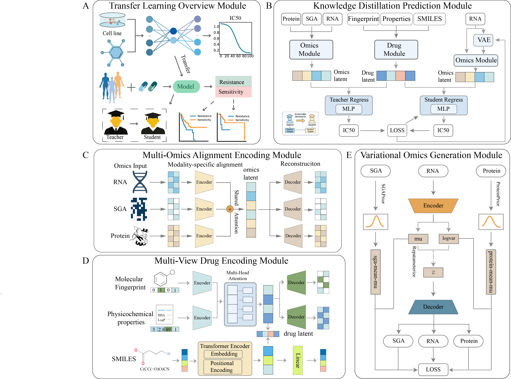

# KMDRP
`KMDRP` (Knowledge-driven Multimodal Drug Response Predictor) is a knowledge distillation-based multimodal fusion interpretable deep neural network framework. It integrates multi-omics data (gene expression, somatic mutations, protein expression) and drug molecular information to predict tumor drug response (IC50 values) and identify potential biomarkers. The framework addresses real-world clinical data incompleteness through a "teacher-student" architecture with task-aware variational generative modeling, enabling accurate predictions using only RNA sequencing data.



## Features

- **High Performance**: The student model (KMDRP-S) achieves state-of-the-art performance, with RMSE = 1.1930 and R² = 0.5960 on independent test sets.
- **Clinical Applicability**: Designed for real-world scenarios with missing omics data, enabling robust predictions using only RNA expression data.
- **Interpretability**: Utilizes integrated gradients and attention mechanisms to provide biological insights into model decisions.
- **Dual-branch Architecture**: Combines a teacher model trained on complete multi-omics data with a student model using knowledge distillation and task-aware generation.
- **Clinical Validation**: Demonstrates prognostic value and treatment guidance potential in independent clinical cohorts.

## Getting Started

### Prerequisites
- Python >= 3.8.x
- PyTorch >= 1.10.0
- RDKit (for molecular fingerprint generation)
- Other dependencies as listed in `requirements.txt`

### Installation

1. Clone the repository:
```bash
git clone https://github.com/bowei-color/KMDRP.git
```

2. Install dependencies:
```bash
pip install -r requirements.txt
```

3. Install RDKit for molecular processing:
```bash
conda install -c conda-forge rdkit
```

### Usage

To train the teacher model with complete multi-omics data:
```bash
python train_teacher.py --rna_path data/rna.csv --sga_path data/sga.csv \
                        --protein_path data/protein.csv --drug_path data/drugs.csv
```

To train the student model with RNA-only data:
```bash
python train_student.py --rna_path data/rna.csv --drug_path data/drugs.csv \
                        --teacher_model models/teacher/best_model.pth
```

## Input Structure

KMDRP implements drug response prediction, where the input includes:
- **Cell line data**: RNA expression, SGA mutations, protein expression (optional)
- **Drug data**: SMILES strings, molecular fingerprints, physicochemical properties

### Example Data Format:

**RNA Expression Data:**
```
Sample,Label,ENSG000001,ENSG000002,ENSG000003,...
GSM123456,1,10.235,1.378,3.546,...
GSM123457,0,8.731,0.556,6.034,...
```

**Drug Data:**
```
Drug_ID,SMILES,Fingerprint,MW,LogP,HBA,HBD,...
Drug001,CC(=O)OC1=CC=CC=C1C(=O)O,010101...,180.16,1.21,4,1,...
```

## Documentation

- **Model Architecture**: KMDRP is a multimodal fusion framework based on knowledge distillation and variational generation.
- **Teacher Model**: Multi-head attention network integrating complete multi-omics data.
- **Student Model**: Lightweight network using only RNA data with knowledge distillation.
- **Task-aware Generation**: Variational autoencoder generating missing modalities from RNA.

## Results

- **Performance**: KMDRP-S achieves RMSE = 1.1930, R² = 0.5960, outperforming 8 baseline methods.
- **Clinical Validation**: Predictions correlate with patient survival (p<0.05) and treatment response.
- **Biomarker Identification**: Identifies key RNA features influencing drug sensitivity predictions.

## Contributing

Contributions to the project are welcome. Please submit a pull request or create an issue in the GitHub repository.

## Contact Authors

Dr. Bowei Yan: boweiyan2020@gmail.com
```
